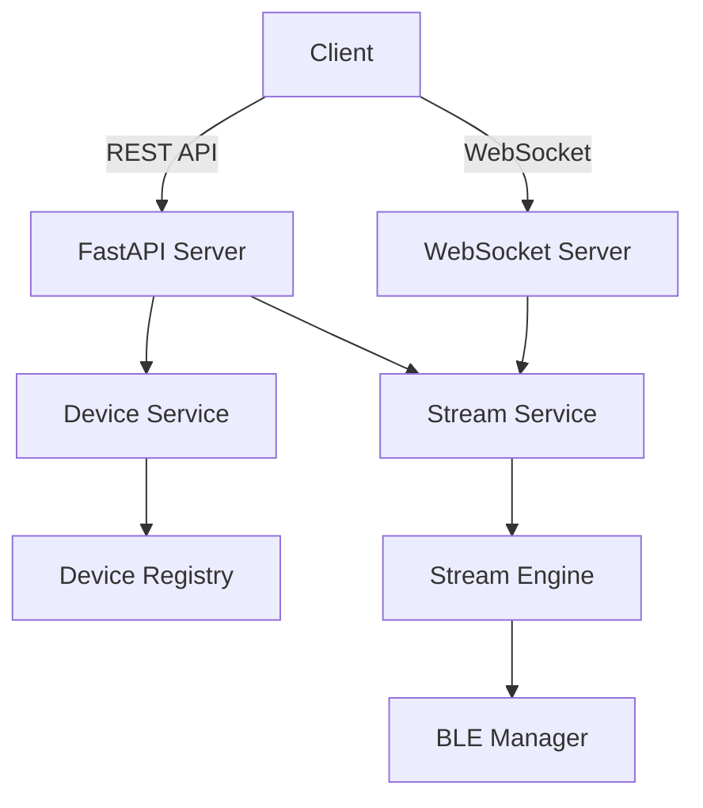

# Link Band SDK

Link Band SDK는 FastAPI와 WebSocket을 기반으로 한 디바이스 관리 및 스트리밍 서버입니다.

## 프로젝트 구조

```
python_core/
├── app/                    # 핵심 애플리케이션 코드
│   ├── api/               # REST API 엔드포인트
│   ├── core/              # 핵심 기능 구현
│   ├── models/            # 데이터 모델
│   ├── services/          # 비즈니스 로직 서비스
│   ├── db/                # 데이터베이스 관련 코드
│   └── config/            # 설정 파일
├── tests/                 # 테스트 코드
├── data/                  # 데이터 파일
└── run_server.py          # 서버 실행 스크립트
```

## 주요 기능

- 디바이스 BLE 관리
- 실시간 스트리밍 엔진
- REST API
- WebSocket API
- 시스템 메트릭 모니터링
- 디바이스 레지스트리

## 설치 방법

1. Python 3.13 이상 설치
2. 가상환경 생성 및 활성화:
   ```bash
   python -m venv venv
   source venv/bin/activate  # Linux/Mac
   # or
   .\venv\Scripts\activate  # Windows
   ```
3. 의존성 설치:
   ```bash
   pip install -r requirements.txt
   ```

## 실행 방법

1. 서버 실행:
   ```bash
   python run_server.py
   ```
   - REST API 서버: http://localhost:8000
   - WebSocket 서버: ws://localhost:18765

2. 테스트 실행:
   ```bash
   pytest
   ```

## API 문서

### REST API

#### 스트리밍 API
- `POST /stream/init`: 스트리밍 서버 초기화
- `POST /stream/start`: 스트리밍 시작
- `POST /stream/stop`: 스트리밍 종료
- `GET /stream/status`: 스트리밍 상태 확인
- `GET /stream/connection`: 연결 정보 확인
- `GET /stream/device`: 디바이스 정보 확인
- `GET /stream/health`: 헬스 체크

#### 디바이스 API
- `POST /device/register_device`: 디바이스 등록
- `POST /device/unregister_device`: 디바이스 해지
- `GET /device/list`: 등록된 디바이스 목록 조회

### WebSocket API

#### 명령어
- `health_check`: 서버 상태 확인
- 응답 형식:
  ```json
  {
    "type": "health_check_response",
    "status": "ok",
    "clients_connected": 1
  }
  ```

## 아키텍처 다이어그램



## 개발 가이드

1. 코드 스타일
   - PEP 8 준수
   - Type hints 사용
   - Docstring 작성

2. 테스트 작성
   - pytest 사용
   - 각 API 엔드포인트에 대한 테스트 작성
   - WebSocket 통신 테스트 포함

3. 에러 처리
   - 모든 API는 적절한 에러 응답 반환
   - 로깅을 통한 문제 추적

## 라이선스

MIT License
